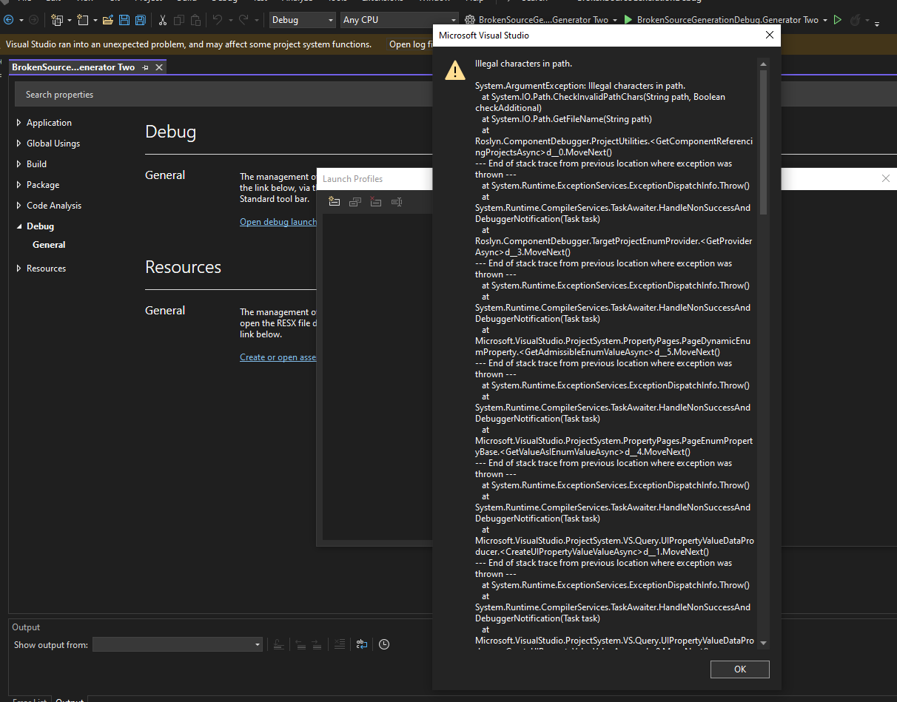

The "BrokenSourceGenerationDebug.Generator Two" project has an error while opening the launch profiles UI.  

Also when trying to create the profile

But it can still debug, when given a path manually to the `targetProject` property in `launchsettings.json` file.

While for the "BrokenSourceGenerationDebug.GeneratorOne" project, the UI works fine.